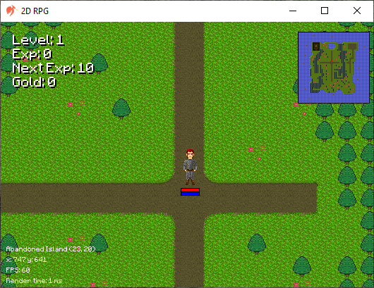
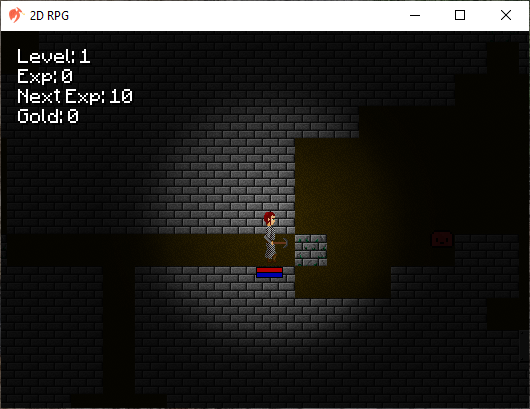
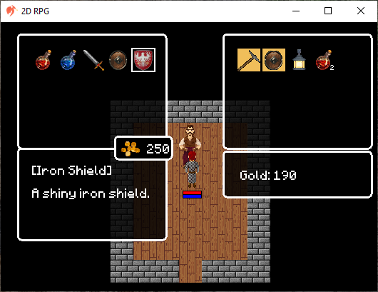
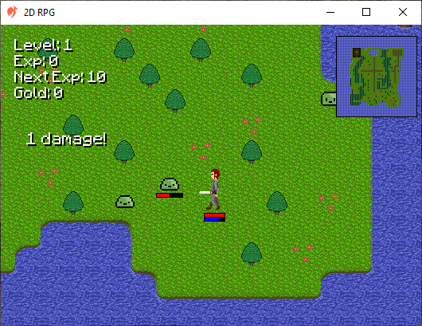
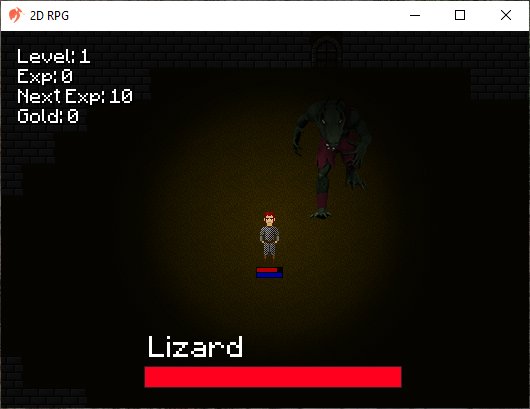

# 2D-RPG
2D RPG style game in pure java inspired by [Argentum Online](https://www.comunidadargentum.com/).

## Introduction
This game is made for educational purposes to better understand how games work under the hood. It does not use third-party libraries or frameworks, it is made from scratch
using the java API (jdk 8 or greater). It covers much of the basic operation of GameLoop, on-screen rendering, collision systems, tile map system, some
mechanics in the handling of physics, among others. I'm not trying to reinvent the wheel either, just that, learn.

## Objective of the game
The objective of the game is basic and brief. Get the keys to the doors until you reach the dungeon and thus be able to complete the labyrinth inside to face the boss who protects the treasure.

The map is small, so you can find hostile creatures and interactive objects such as chests, doors, and some events. There are two npcs, one is an old wanderer and another is the merchant who waits for you inside a house. Always have your flashlight on hand so you don't get lost in the shadows and try to bring the necessary tools to advance in the dungeons.

## Screenshots

## Controls
Confirm/Attack: Enter
 
Options/Back: ESC
 
Move: WASD
 
Shoot: F
 
Pickup Item: P
 
Minimap: M
 
Inventory: I
 
Stats Window: C
 
Debug: Q
 
Test Mode: T
 
Hitbox: H

_Note: The **H** key show the entities hitbox in green, the frame in magenta and the attack collider rectangle in red. The **T** key activates Test Mode to be able to see in the dark, ignore the collision of solid tiles and never die._

## Technical details
Although the resolution of the tiles is fixed at 32x32 pixels, it is possible to adjust it in powers of 2 to guarantee the integrity of the graphics and avoid distortion problems. The default frame rate per second (FPS) and updates per second (ticks) are set to 60. If the screen is maximized, possible degradation of graphical quality due to the use of pixel art textures should be considered. In relation to the _top-down_ camera, only the tiles that are within the field of view are rendered, avoiding the rendering of the entire extensive map made up of 100x100 tiles. For the collision system, the collision is checked with the hitbox of each entity, while the intervals of the actions are managed through the Timer class. It also has an environment system, where the day cycle is divided into 4 parts: day, dusk, night and dawn.

## Future of the project
There is no clear objective of how the project will continue, i simply started it with the idea of being able to show graphics on the screen and it ended up getting out of hand. I'm going to continue polishing the code as much as i can without adding more features so as not to extend the code. The current idea would be to have it as clean as possible to have a "possible" reference of the structure of a game.

## Thanks and credits
First of all I want to thank **[@RyiSnow](https://www.youtube.com/@RyiSnow)** for sharing his knowledge to the public with his playlist [How to Make a 2D Game in Java](https://www.youtube.com/watch?v=om59cwR7psI&list=PL_QPQmz5C6WUF-pOQDsbsKbaBZqXj4qSq). Much of the structure of the game is based on its tutorial. Also to the Argentum Online (AO) community for inspiring me to create my own game engine thanks to their open source mentality. Some graphics and sounds were taken from the AO community, so if you are the author of one of them do not hesitate to write to me to give you the credits. The Skeleton sprite is courtesy of Ryi.

### Bugs and Tasks
If you want to collaborate you can see the following list of bugs and tasks: https://trello.com/b/Z3rOH49q/2d-rpg
