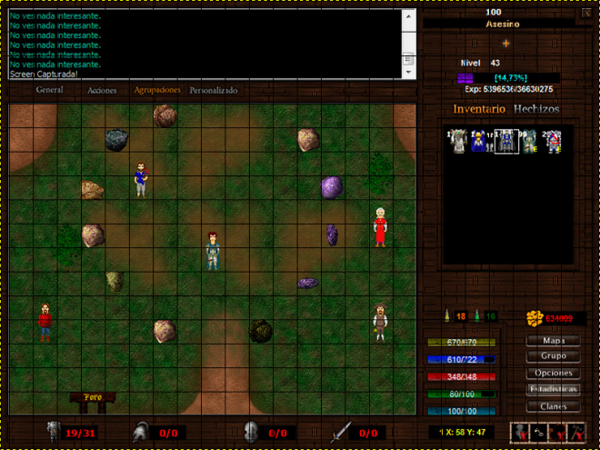

## Detalles técnicos

A continuación voy a dar algunos detalles básicos de los conceptos técnicos mas importantes que componen al argentum.

### Render

Un dato menor, es que la primera resolución de argentum fue (y se sigue utilizando) de 800*600 pixeles, siendo esta una relación de aspecto 4:3 que encajaba con los monitores de tubos catódicos del mismo tamaño, logrando ejecutar el juego en pantalla completa sin que este perdiera calidad. Hoy en día, se utilizan diferentes resoluciones y tamaños de pantalla, lo que hace que el juego tenga que adaptarse (con programación y diseño) a nuevos cambios para mejorar la calidad grafica, pero eso es otro tema que voy a explicar mas adelante.

Para renderizar el mapa del juego se utilizan tiles de 32x32 pixeles (aunque puede variar), y teniendo en cuenta la resolución 800x600, solo se llegan a visualizar 17 en el eje x e 13 en el eje y, dando así una mayor visión horizontal. ***Es importante aclarar que los tiles sobrantes (8 y 5) de la resolución representan a la interfaz y los otros al “RenderPic”***.

Acá se puede ver la cantidad de espacios que ocupa el render (la parte donde se muestra el juego) y la interfaz. Los personajes ocupan dos grillas verticales. Esto se debe a que el cuerpo tiene un tamaño de 19x37 aproximadamente mas la cabeza que es de 17x16. Para clicks el tile importante es el de arriba ("la cabeza") y para colisiones el tile importante es el de los pies.

### Tiles

El tamaño del tile (lógico, a nivel de código) es de 32x32, el gráfico del pasto es de 128x128, es decir ocupa 4x4 tiles. Esto sirve para disimular las repeticiones en el patrón y mejorar el aspecto visual.

### Relación de tamaño entre resolución y tile

Hoy en día se utilizan monitores de 1920x1080 (16:9) o resoluciones similares. Esto significa que utilizar tiles de 32x32 en estas resoluciones de gran tamaño con un RenderPic de 17x13 tiles, afecta el aspecto visual de los graficos ya que estos se pixelean y "estiran" a la vista del jugador. En caso contrario, utilizar una resolución pequeña en pantallas grandes haría el render muy chico. El render se puede agrandar o achicar dependiendo de la resolución, pero la cantidad de tiles dentro de la vista del jugador siempre va a ser la misma (lógicamente), por eso se estiran o achican con estos cambios, para "compensar" esa cantidad. Por lo tanto, lo ideal seria cambiar el tamaña a tiles de 64x64 para darle mas detalles a estos y poder hacer animaciones un poco mas estéticas. Aunque esto no termina de solucionar todos los problemas, ya que es falso que la mayoría de los usuarios usan resoluciones 1920x1080. Las resoluciones 1366x768 y 1024x768 (proporciones 4:3) son MUY usadas, principalmente en Notebooks, y para esa altura (64), no llega ni a los 13 tiles verticales del RenderPic. Por lo tanto, lo ideal sería usar tiles de 48x48, y nada más. La otra opción es hacer todo en grande pensado para 1920x1080 y que se escale a resoluciones más chicas, eso sería lo 100% ideal.

Otra idea interesante (y nose si la mejor) es implementar la *niebla de guerra* para que el juego se adapte a cualquier resolución sin "romper" el formato clásico.

### Cámara

Con respecto a la cámara que es de tipo top-down, solo se dibujan los tiles que estan dentro de esta, evitando un mal rendimiento ya que los mapas son de 100x100 tiles.

### Estilo artístico
