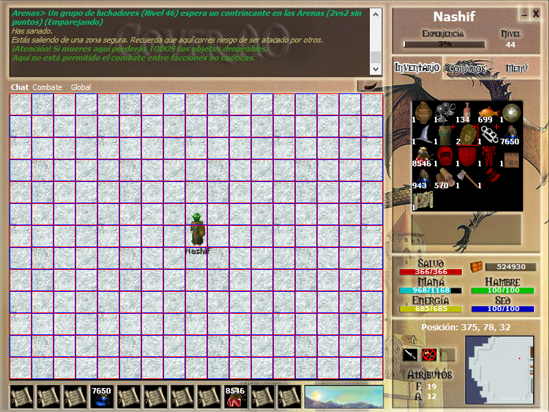

## Detalles técnicos

A continuación voy a resumir conceptos técnicos clave del Argentum y proporcionar soluciones para los problemas que
puedan surgir.

### Tile

El tamaño del tile (lógico, a nivel de código) es de 32x32, el gráfico del pasto es de 128x128, es decir ocupa 4x4
tiles. Esto sirve para disimular las repeticiones en el patrón y mejorar el aspecto visual.

### Render

Un dato menor, es que la primera resolución de Argentum fue (y se sigue utilizando aunque cueste creerlo) de 800x600
pixeles, siendo esta una relación de aspecto 4:3 que encajaba con los monitores de tubos catódicos del mismo tamaño,
logrando ejecutar el juego en pantalla completa sin que este perdiera calidad. Hoy en día, se utilizan diferentes
resoluciones y tamaños de pantalla, lo que hace que el juego tenga que adaptarse (con programación y diseño) a nuevos
cambios para mejorar la calidad grafica, pero eso es otro tema que voy a explicar mas adelante.

El mapa del juego se crea usando tiles de 32x32 píxeles. En la resolución 800x600, solo se pueden ver 17 tiles
horizontales y 13 verticales en el mapa. El espacio restante en el renderizado se dedica a la interfaz del juego,
que incluye elementos como la consola y el inventario.

Esta imagen muestra la cantidad de tiles que ocupa el render del mapa. Los personajes ocupan dos grillas verticales.
Esto se debe a que la suma del cuerpo (37px) mas la cabeza **incrustada** (11px de los 13px que ocupa) da un alto de
48px. Para clicks el tile importante es el de arriba ("la cabeza") y para colisiones el tile importante es el de los
pies.

### Relación de tamaño entre resolución y tile

Actualmente, los monitores tienen una resolución de 1920x1080 (16:9) o similares. Usar tiles de 32x32 en estas
resoluciones grandes, con un área de visualización de 17x13 tiles, distorsiona la apariencia de los gráficos,
haciéndolos ver pixelados y alargados para el jugador. Si se usara una resolución pequeña en pantallas grandes, el área
de visualización sería demasiado pequeña. Para mantener el número de tiles visibles, se ajusta su tamaño, ya sea
estirándolos o reduciéndolos según la resolución. Esto significa que jugar Argentum en pantalla completa en un monitor
de 1920x1080 se verá mal, pero mostrará lo mismo que alguien jugando en un un fósil informático con resolución 800x600.
Se sugiere cambiar a tiles de 64x64 para más detalles y animaciones atractivas, aunque esto no resuelve todo, ya que
muchas personas usan resoluciones como 1366x768 y 1024x768 (proporciones 4:3), principalmente en Notebooks, y para esa
altura (64), no llegan ni a los 13 tiles verticales de la resolucion 800x600. En consecuencia, parece más adecuado usar
tiles de 48x48 para resolver estos problemas.

La otra opción es remasterizar gráficamente el juego por completo para que la resolución por defecto esté pensada en
1920x1080 y desde ahi escalar los gráficos hacia abajo, manteniendo la calidad. También se sugiere ampliar las imágenes
originales dos veces mediante redes neuronales para evitar rediseñar todo el arte, con mínima pérdida de calidad. Sin
embargo, este enfoque puede resultar en gráficos demasiado planos en resoluciones muy altas. Para solucionar esto, se
propone cambiar la perspectiva de los personajes y los gráficos en general, creando un impacto visual distinto al verlos
desde una perspectiva diagonal "desde arriba", en lugar de la vista completamente plana utilizada en el Argentum, además
de permitir la adición de sombras más sutiles.

Otra idea interesante (y nose si la mejor) es implementar la *niebla de guerra* para que el juego se adapte a cualquier
resolución sin "romper" el formato clásico, permitiendo ver solo los graficos pero no los mobs/personajes.

### Cámara

Con respecto a la cámara que es de tipo top-down, solo se dibujan los tiles que estan dentro de esta, evitando
renderizar todos los tiles que ocupa el mapa de 100x100 tiles.

### Estilo artístico
